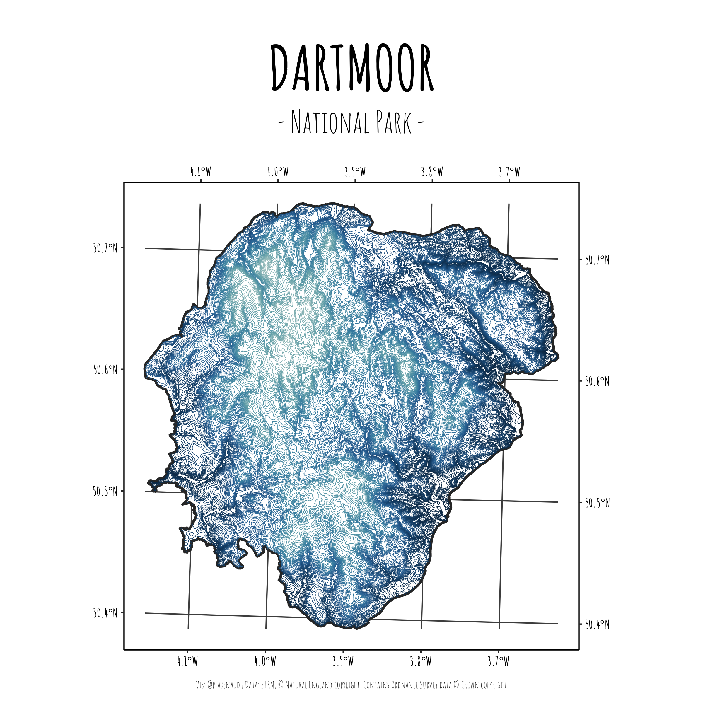
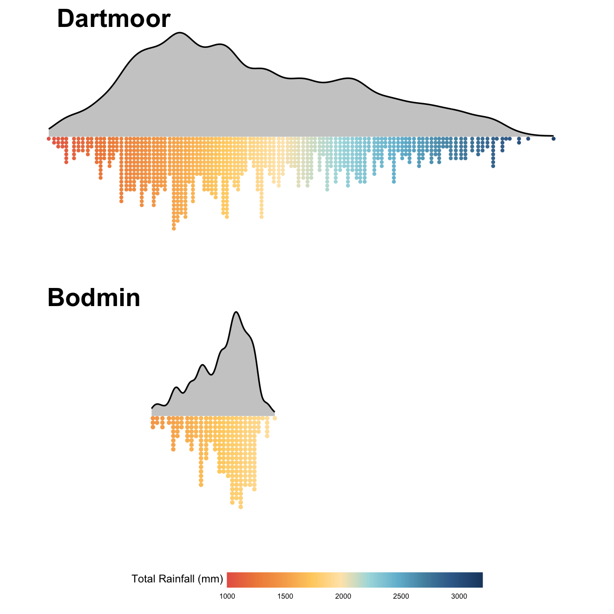

## Getting into Rspatial

I've decided I want to get better at all things Rstats, and particularly Rspatial, so here's a project filled with my random mapping or spatial data explorations in combination with lots of {tidyverse} wranglings.

[Dartmoor_Contours.R](Dartmoor_Contours.R)
Using {elevatr} to get elevation data for Dartmoor and turning it into a contour plot (for use over at [laserandgrain]). Also made a raster plot and boosted with {rayshader}

[Bodmin_Dartmoor_Rain.R](Bodmin_Dartmoor_Rain.R)
Downloaded CEH-GEAR 2019 monthly data and used it to plot the distribution of total rainfall on Bodmin and Dartmoor as a cloudplot using ggdist. Data extracted using a combination of {sf}, {terra} and {ncdf4}.

[Mapviewer.R](Mapviewer.R)
I need to learn how to use QGIS (or do I?), but in the meantime, I've made a quick shapefile viewer using {leaflet} for the basemap. For some reason... it's suddenly a bit temperamental with addPolygons using a {sf} object? View set by the sf centroid.

[laserandgrain]: https://www.instagram.com/laserandgrain/

